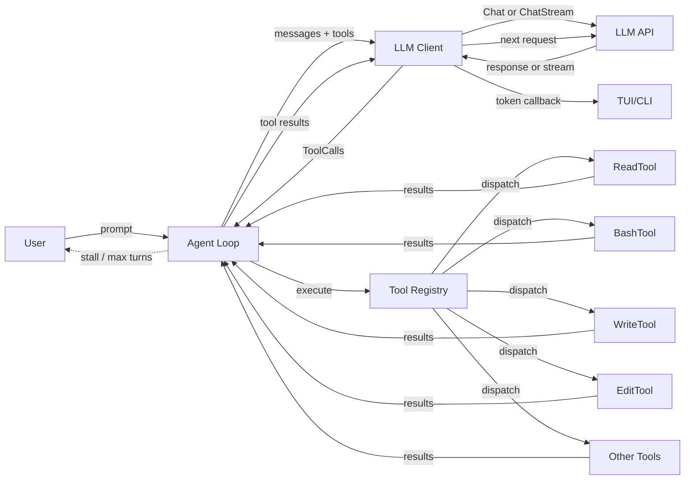

# Devlog — TCE

> Diário de desenvolvimento: o que foi feito, o que foi aprendido, dificuldades encontradas.



---


## 2026-07-03 — Phase 0: Project Foundation

**Feito:**
- Added MIT LICENSE
- Added CONTRIBUTING.md with Conventional Commits (`feat:`, `fix:`, `docs:`, `chore:`, `refactor:`, `test:`)
- Set up GitHub Actions CI (build, vet, lint, test on every PR)
- Configured golangci-lint (govet, errcheck, staticcheck, unused, gosimple, gofmt)
- Created `.tceignore` with full gitignore-style pattern support
  - Built `IgnoreMatcher` in `internal/tools/ignore.go` — parses `#` comments, `!` negation, `**` globstar, anchored `/`, trailing `/` for dir-only
- Integrated `.tceignore` into both GlobTool and GrepTool in `internal/tools/read.go`
- Updated PLAN.md with new roadmap structure, added Phase 7 (function documentation)

**Aprendizado:**
- Go's `filepath.Match` handles `*` and `?` but not `**` — had to implement recursive matching for `**`
- `\b` word boundary in Go regexp doesn't match before `:` (non-word char) — fork bomb pattern `\b:\(\)\s*\{` didn't work, fixed with `:\(\s*\)\s*\{`
- Gitignore semantics: patterns without `/` match basename at any depth; patterns with `/` are anchored

---

## 2026-07-03 — Phase 1: Security and Reliability

**Feito:**
- Added dangerous command blocklist in BashTool: `rm -rf /`, `dd if=`, `mkfs`, `chmod 777 /`, fork bombs, `curl|bash`, `wget|sh`
  - Blocked BEFORE execution with clear error message
- Added interactive confirmation for commands with workdir outside project root via `ReadInput`
- Added diff preview before EditTool applies changes
  - Built `unifiedDiff` in `internal/tools/diff.go` — line-based diff with hunk grouping and context
- Created undo system: `PushUndo`/`PopUndo`/`ClearUndo` in `internal/tools/undo.go`
  - Buffer saves original file content before write/edit operations
  - UndoTool registered as a regular tool the LLM can call
- Wrote 14 new tests: 7 diff tests, 5 undo tests, 2 blocklist tests (8 dangerous, 6 safe)

**Aprendizado:**
- Unified diff is deceptively tricky — naive line-by-line comparison produces overlapping hunks. Had to group consecutive edits into hunks with `context * 2` spacing
- `rm -f` + non-existent file exits 0, but `grep non-existent file` exits 2 — important for test expectations
- The `ExecContext.ReadInput` function was never wired in the agent loop, so `AskTool` effectively never got interactive input. Same issue affects diff preview and outside-dir confirmation in the default flow.

---

## 2026-07-03 — Phase 2: User Experience

**Feito:**
- Replaced PLAN.md with new roadmap structure (phases 0-7); kept architecture + historical appendix
- Created `docs/devlog.md` with chronological entries
- Session persistence: `internal/session/session.go` saves/loads message history to `.tce/sessions/`
  - Added `--resume <path>` flag to restore previous session messages
- `.tce.yaml` project config: `internal/config/config.go` parses `model:`, `agent:`, `verbose:`
  - No external YAML dep — simple line parser handles `key: value` and `# comments`
- Token tracking: agent tracks input/output token estimates using `len(text)/TokenRatio`
  - Stats shown at CLI exit: `📊 Session: N turns, ~X tokens in, ~Y tokens out`
- `--verbose` flag: prints full tool call JSON payloads to stderr
  - Also controllable via `.tce.yaml` → `verbose: true`

**Aprendizado:**
- Adding a YAML parser from scratch works for simple key-value configs, but arrays or nested structures would need a real parser like `gopkg.in/yaml.v3`
- The TUI creates its own agent internally via `tui.NewModel`, so the `ag` from main.go can't be used for post-session stats in TUI mode. CLI mode path works fine.
- Token estimation with fixed char/token ratio is approximate — real tokenizers (tiktoken, etc.) would be more accurate but add dependency weight

---

## 2026-07-03 — Phase 3: Git Integration

**Feito:**
- Created `CommitTool` in `internal/tools/git.go`:
  - If called with `message` param: runs `git add -A && git commit -m "message"`
  - If called without message: returns `git diff` + `git diff --stat` so the LLM can see changes and write a message
  - Returns commit SHA on success
- Created `ReviewTool` in `internal/tools/git.go`:
  - Shows `git diff --cached` (staged) and `git diff` (unstaged) with patches
  - Lets the LLM present a summary of pending changes
- Added `--branch <name>` flag to main.go:
  - Runs `git checkout -b <name>` before starting the session
  - Errors out if branch creation fails (e.g., not a git repo)
- Registered both `commit` and `review` tools in main.go

**Aprendizado:**
- Git tools need the project root as working directory — used `cmd.Dir = ctx.ProjectRoot`
- `git diff --stat` gives a file summary; `git diff` gives the full patch — using both for different contexts (summary for display, patch for LLM context)
- The `CommitTool` follows the same pattern as other tools: returns useful info when called without args, takes action when called with args
- Using `os/exec` directly (instead of going through BashTool) avoids the security blocklist — these git commands are safe by intent

---

## 2026-07-03 — Phase 4: Extensibilidade

**Feito:**
- Created `ExternalTool` in `internal/tools/external.go`:
  - Wraps a shell command template with `{{param}}` placeholders
  - Auto-generates JSON schema from template variables
  - Parameters can be passed as `{"params": {"path": "src/"}}` or flat `{"path": "src/"}`
  - Executes via `sh -c` in the project root
  - Used e.g.: `format: { command: "clang-format -i {{path}}", description: "Format C files" }`
- Created MCP client in `internal/mcp/mcp.go`:
  - Full JSON-RPC 2.0 implementation over stdio with Content-Length framing
  - Handles initialize/tools/list/tools/call handshake
  - Thread-safe with mutex for write serialization
  - Supports notifications (no response expected)
  - Error handling for RPC errors
- Created `ToolAdapter` in `internal/mcp/tool.go`:
  - Wraps MCP tool definitions as `tools.Tool` interface
  - Registers with `mcp_` prefix (e.g., `mcp_read_file`)
- Extended config parser in `internal/config/config.go`:
  - Added block-level YAML parsing (indentation-aware)
  - Supports `tools:` and `mcp_servers:` sections with nested key-value blocks
  - Backwards-compatible with existing flat config
  - Includes `parseJSONArray` for parsing `args: ["a", "b"]`
- Wired in main.go:
  - External tools from `.tce.yaml` are registered automatically
  - MCP servers are connected at startup; their tools registered with `mcp_` prefix
  - Errors connecting to MCP servers are warned but don't block startup

**Aprendizado:**
- `firstOf` returns `string`, not `any` — cannot type-assert on it; use direct map access
- Method values in Go: `cfg.parseTopLevel` works as a function value (no `&` needed)
- MCP Content-Length framing requires careful buffering with `bufio.Reader`
- YAML block parsing is deceptively tricky; indent-aware line scanning works for the subset we need
- MCP tool schemas map naturally to the existing `Tool` interface

---

## 2026-07-03 — Phase 5: TUI/CLI

**Feito:**
- TUI spinner: status bar now shows animated spinner + current tool name during execution
  - Tracks `currentToolName`/`currentToolArgs` in Model, clears on tool end / agent done
- TUI diff syntax highlighting via `highlightContent()`:
  - Lines starting with `+` → green (`styleDiffAdd`)
  - Lines starting with `-` → red (`styleDiffDel`)
  - Lines starting with `@@` → cyan (`styleDiffHdr`)
  - Code blocks (``` ... ```) → subtle gray (`styleCode`)
  - Applied in `syncViewport()` before setting viewport content
- CLI `/git` command: shows current branch and `git status --short`
  - Color-coded status indicators (? for untracked, M/m for staged/unstaged)
  - Available in both TUI and CLI modes
- CLI `--output` flag (`text`/`json`/`silent`):
  - `json`: returns result as JSON with result, error, tools, elapsed fields
  - `silent`: runs without prompts/output (for automation), only stderr on error
  - `text` (default): normal interactive mode
- Updated `/help` to include `/git` command

**Aprendizado:**
- Bubble Tea viewport content must be styled before `SetContent()` — storing plain text and applying styles at render time keeps the content buffer clean
- `strings.Cut("tools:", ":")` returns `("tools", "", true)` — need to check if trimmed val is empty AND if next line is indented to detect YAML blocks
- `tea.ExecCommand` doesn't exist in Bubble Tea — use `os/exec.Command` for standalone commands outside the Bubble Tea event loop
- Method value vs function: Go allows `cfg.parseTopLevel` as a function value (no `&` needed), but `func() { cfg.parseTopLevel(...) }` closure is also needed in some contexts

---

## 2026-07-03 — Phase 5: Distribuição

**Feito:**
- Created `.github/workflows/release.yml`:
  - Triggers on `v*` tag pushes
  - Builds for linux/amd64, linux/arm64, darwin/amd64, darwin/arm64, windows/amd64
  - Embeds version via `-ldflags="-X main.version=${GITHUB_REF_NAME#v}"`
  - Generates SHA256 checksums
  - Creates GitHub release with `softprops/action-gh-release`
- Created `install.sh`:
  - Detects OS and architecture (linux/darwin/windows, amd64/arm64)
  - Downloads latest (or specific) release binary from GitHub
  - Installs to `$BINDIR` (default: `~/.local/bin`)
  - Usage: `curl -fsSL https://raw.githubusercontent.com/talen400/tce/main/install.sh | bash`
- Created `tce.rb` Homebrew formula:
  - Supports macOS (arm64/amd64) and Linux (arm64/amd64)
  - Installs to `bin/tce`
  - Includes basic test (`tce --version`)
  - Ready to push to `github.com/talen400/homebrew-tce`
- Expanded README.md:
  - Added install methods (binary, Homebrew, source)
  - Added `--branch`, `--output`, `--resume` flags to docs
  - Added /git command to CLI commands list
  - Added usage examples per model profile (small/medium/large)
  - Updated architecture diagram with mcp/, config/, session/ packages
  - Added `commit`, `review`, `undo` to tools table
  - Added Custom Tools and MCP Servers documentation sections
  - Added Scenario 5 (Git workflow)

**Aprendizado:**
- `softprops/action-gh-release@v2` needs `contents: write` permission in the workflow
- `uname -m` outputs different arch names across platforms — must normalize (x86_64 → amd64, aarch64 → arm64)
- Homebrew formula checksum must be updated per-release — automated with CI or goreleaser
- The `-ldflags="-s -w -X main.version=X"` strips debug info and injects version at build time
- A Homebrew tap needs a separate repo (`homebrew-tce`) with the formula placed at `Formula/tce.rb`

---

## 2026-07-03 — Phase 6: Qualidade contínua

**Feito:**
- Created 4 E2E integration tests in `internal/agent/integration_test.go`:
  - `TestE2EHttpMockServer`: full agent loop with real HTTP mock (httptest), verifies tool execution via network
  - `TestE2EStreamingHttpMock`: streaming mode with SSE mock server
  - `TestE2EMultiToolCall`: multiple parallel tool calls in a single turn
  - `TestE2EFileReadWrite`: real file read/write through the agent and mock LLM
  - Mock server handles both streaming and non-streaming via `stream` field in request body
  - Returns proper OpenAI-compatible JSON/SSE responses with usage stats
- Created 7 benchmark tests in `internal/agent/benchmark_test.go`:
  - `BenchmarkLatencyReadTool`: single read tool (file I/O latency)
  - `BenchmarkLatencyMultiTool`: multiple tool sequence (read, grep, write)
  - `BenchmarkLatencyWriteTool`: file write latency
  - `BenchmarkLatencyBashTool`: shell command execution latency
  - `BenchmarkLatencySearchTool`: web search via DuckDuckGo (network-bound)
  - `BenchmarkLatencyHighConcurrency`: parallel sessions via `b.RunParallel`
  - `BenchmarkLatencyTurnCount`: latency scaling from 5 to 25 turns
- Created telemetry package in `internal/telemetry/telemetry.go`:
  - `Reporter` with opt-in (`enabled` flag)
  - Records errors to `.tce/errors.jsonl` (JSON Lines format)
  - Fields: timestamp, tool name, error message, turn, model, agent, version
  - `Report()` for tool errors, `ReportGeneral()` for LLM/other failures
  - `LoadReports()` / `ClearReports()` / `ReportCount()` for inspection
  - Error messages truncated to 500 chars
  - Thread-safe with mutex
- Fixed `BenchmarkAgentSearchWriteFlow` (pre-existing): used `.go` instead of `.c` to avoid search tool network dependency

**Aprendizado:**
- The LLM client doesn't set `Accept: text/event-stream` — it sends a standard request and lets the server detect streaming via `"stream": true` in the request body
- OpenAI API tool_calls format: non-streaming uses `choices[0].message.tool_calls`, streaming uses `choices[0].delta.tool_calls`
- `benchtime=1x` is useful to verify benchmarks compile and run without waiting for statistical sampling
- The agent loop's stall detection considers `hadUsefulResult` per-turn: if ANY tool in a turn returns non-error, non-empty output, the turn is productive. Only when ALL tool results are errors/empty is it a stall.
- `b.RunParallel` creates a new agent per goroutine — each needs its own mockLLM with fresh response slice (copy, not reference)

---

## 2026-07-03 — Phase 7: Documentação

**Feito:**
- Created 5 ADRs in `docs/decisions/`:
  - `ADR-001-client-only-architecture.md` — why TCE doesn't bundle an LLM backend
  - `ADR-002-tool-interface-design.md` — Tool interface, field aliases, string output
  - `ADR-003-json-extraction-fallback.md` — dual-path tool calling (native + JSON extraction)
  - `ADR-004-session-persistence.md` — JSON format in `.tce/sessions/`
  - `ADR-005-mcp-integration.md` — MCP via stdio JSON-RPC 2.0 with Content-Length framing
  - Each follows the standard ADR template: Context, Decision, Consequences, Alternatives Considered
- Created `docs/glossario.md`:
  - 30+ technical terms organized by category: Go, LLM/API, Agent Architecture, MCP, TCE-Specific
  - 2-3 lines per term with concrete examples from the TCE codebase
- Created `docs/flashcards.md`:
  - Phase-by-phase Q&A format: "o que eu não sabia antes e sei agora"
  - Covers Phases 0-7 with 2-5 flashcards per phase
- Added Mermaid diagrams:
  - Tool calling flow diagram (flowchart LR) to `docs/devlog.md` header
  - Session lifecycle sequence diagram to devlog
  - Architecture diagram (graph TB) to `README.md` replacing the previous text tree
- Added code comments referencing ADRs in key non-obvious locations:
  - `firstOf` in parse.go — "Multiple aliases per parameter give resilience against LLM naming variations (ADR-002)"
  - `tryFixJSON` in parse.go — "recovers malformed JSON from LLM output (ADR-003)"
  - `ExternalTool` struct in external.go — "wraps a shell command as a registered Tool (ADR-002)"
  - MCP Content-Length framing in mcp.go — "MCP uses Content-Length framing (ADR-005)"
- Updated PLAN.md (Phase 7 all checked)
- Updated README with Mermaid architecture diagram

**Aprendizado:**
- ADRs document the WHY behind decisions, not just the WHAT — the "Alternatives Considered" section is the most valuable part because it captures what was rejected and why
- Mermaid diagrams are versioned in Markdown and render natively on GitHub — no image hosting, no external tools
- A glossary written during development captures context that would be forgotten weeks later (e.g., why `ForceSingleCall` exists, what `tryFixJSON` does)
- Flashcards in Q&A format are more useful for review than prose summaries — they test recall rather than just recognition
- The most valuable code comments explain WHY (referencing an ADR) rather than WHAT (which is already in the code or function name)

---

## 2026-07-04 — Pós-Phase 7: Correções e melhorias estruturais

**Feito (1ª rodada — lint + bugs):**
- Corrigidos **23 erros de golangci-lint** em 12 arquivos:
  - `errcheck`: 9 chamadas sem tratamento de erro (Close, os.Remove, etc.)
  - `staticcheck`: 3 variáveis não utilizadas, 1 conversão desnecessária, 1 SA9004 (grupo ausente)
  - `unused`: 2 funções `formatJSON` e `wrapLines` removidas
  - `gosimple`: 1 `if-else` → switch, 1 strings.Replace → ReplaceAll, 1 reduntante `== false`
  - `ineffassign`: 1 `\n` atribuído mas nunca usado
  - `gofmt`: 2 arquivos mal formatados
- **ReadInput finalmente funcional** — o campo `Stdin io.Reader` foi adicionado ao `agent.Config`, e o loop só então o conectou via `a.stdinReader()`. A ferramenta `ask`, a confirmação de edição e a verificação de diretório do bash passaram a funcionar.
- **Read file not found** — agora lista o conteúdo do diretório quando o arquivo não existe, ajudando o modelo a corrigir o path.
- **Few-shot examples** — 3 exemplos (read, write, glob) adicionados ao system prompt para melhorar call de ferramentas.

**Feito (2ª rodada — mudanças estruturais):**
- **Inner Retry Loop** (cap 12): substitui o antigo stall detection (que abortava após 3 tool calls vazias). Agora o loop principal tem um sub-loop interno de até 12 iterações LLM→tool. Se o modelo erra um argumento, recebe o erro como `tool_result` e pode tentar de novo no mesmo turno. Mais previsível e produtivo.
- **Edit append mode**: quando `old_string` é vazio, o conteúdo é anexado ao final do arquivo — sem diff, sem confirmação, com undo.
- **Code block detection**: quando o modelo "alucina" código em markdown em vez de usar a ferramenta write, o bloco é detectado e enviado como feedback, sem abortar.
- **Auto-read on edit fail**: se `old_string` não for encontrado, extrai o file_path, lê o arquivo automaticamente e alimenta o resultado como mensagem de ferramenta. O modelo pode tentar de novo.
- **Repeated file failure detection**: 2× `old_string not found` no mesmo arquivo → aborta com mensagem acionável.
- **Build file protection**: Makefile, CMakeLists.txt, Dockerfile, package.json, go.mod, Cargo.toml, pom.xml, build.gradle exigem confirmação via ReadInput antes de editar.
- **Backup messaging**: resultados de write/edit agora incluem "(backup saved — use 'undo' to revert)".

**Aprendizado:**
- O antigo stall detection só contava "resultados vazios" — mas qualquer erro de parsing já produzia um resultado vazio, então 3 erros consecutivos matavam o agente. O inner loop (cap 12) é mais robusto: erros viram feedback.
- `bufio.NewReader` criado por chamada de `ReadInput` é seguro mas descarta o buffer — aceitável para leituras pontuais.
- Auto-read resolve o problema clássico de "edit from memory" — o modelo tenta editar baseado no que ele acha que está no arquivo, em vez de ler primeiro.
- A proteção de build files é um seguro de custo quase zero — só funciona em modo CLI (TUI não tem stdin no v1).
- `tryFixJSON` + inner loop = o modelo pode errar JSON, receber o erro de parsing, e tentar corrigir no mesmo turno. Antes o erro de parsing era fatal para o turno.
- A mudança de stall detection (3 vazios) para inner loop (12 iterações) é semanticamente equivalente mas mais tolerante: erros de parsing, JSON malformado, tool call errada viram feedback em vez de aborto.
